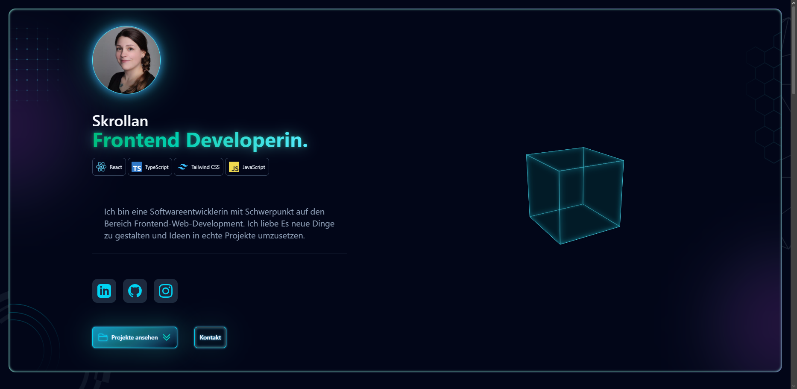

# Portfolio – Skrollan

Mein persönliches Portfolio als Frontend-Entwicklerin mit Fokus auf modernes UI-Design, Animationen und sauberes, wartbares CSS.

**🔗 Live ansehen:** [schokett.github.io/Portfolio](https://schokett.github.io/Portfolio/)



## ✨ Features

- **Neon/Nebula-Design** – dunkles Slate-Theme mit Teal-, Cyan-, Violett- und Fuchsia-Akzenten, Gradient-Borders und Glow-Effekten
- **3D-CSS-Cube-Animation** – umgesetzt mit `requestAnimationFrame` und `useRef`, ohne externe Animations-Library
- **Scroll-Effekte** – Parallax- und Rotationseffekte beim Scrollen
- **Vollständig responsiv** – optimiert für Mobile, Tablet und Desktop
- **Wiederverwendbare Komponenten** – u. a. prop-gesteuerte Buttons, Projekt-Cards und Social-Icons mit dynamischen SVG-Gradienten (`useId()`)

## 🛠️ Tech-Stack

| Bereich    | Technologie                                    |
| ---------- | ---------------------------------------------- |
| Framework  | React 19                                       |
| Sprache    | TypeScript                                     |
| Styling    | Tailwind CSS v4                                |
| Routing    | React Router (mit `basename` für GitHub Pages) |
| Build-Tool | Vite                                           |
| Deployment | GitHub Actions → GitHub Pages                  |

## 🚀 Lokal starten

```bash
git clone https://github.com/Schokett/Portfolio.git
cd Portfolio
npm install
npm run dev
```

Der Dev-Server läuft anschließend unter `http://localhost:5173`.

## 📦 Build & Deployment

Das Projekt wird bei jedem Push auf `main` automatisch über GitHub Actions gebaut und auf GitHub Pages deployt.

```bash
npm run build   # Produktions-Build in /dist
```

## 📬 Kontakt

- GitHub: [@Schokett](https://github.com/Schokett)
- Instagram: [@hyodo.websitedesigns](https://instagram.com/hyodo.websitedesigns)
